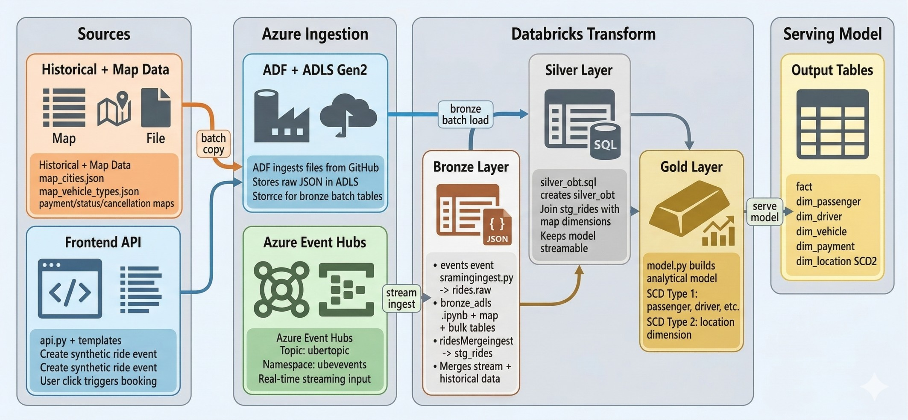

# Azure-Streaming-Batch-DE-Pipeline_Project

This project simulates a real-world ride platform pipeline where ride events are generated in real time, combined with historical + mapping datasets, and transformed into analytics-ready dimensional models.

## Architecture



## Project Overview

- Frontend/API (`FastAPI`) generates synthetic Uber ride events.
- Events are published to `Azure Event Hubs`.
- Historical + map reference files are stored in `ADLS Gen2` (ingested via `Azure Data Factory` from this repository's `Data/` files).
- `Databricks` pipelines ingest streaming events and bronze reference/history tables.
- Streaming events are parsed to a standard schema and merged with historical rides into a unified staging stream.
- A silver OBT (One Big Table) is built as a streamable table.
- Gold layer produces fact + dimension tables with both `SCD Type 1` and `SCD Type 2` handling.

## Tools And Services Used

- Python, FastAPI, Jinja2
- Azure Event Hubs
- Azure Data Lake Storage Gen2 (ADLS)
- Azure Data Factory (ADF)
- Azure Databricks (Delta Live Tables / Lakeflow Declarative Pipelines)
- Delta Lake

## Repository Layout

- `api.py`: FastAPI app and UI endpoints for booking rides.
- `connection.py`: Event Hub producer integration.
- `data.py`: Synthetic ride event generator.
- `Data/`: Historical ride data + mapping datasets.
- `Code_Files/`: Databricks notebooks, SQL, and pipeline Python files.
- `templates/`: Frontend HTML pages.

## Databricks Pipeline Flow

1. `eventstreamIngest.py` reads Event Hub stream into `rides_raw`.
2. `bronze_adls.ipynb` loads map/history files from ADLS into bronze Delta tables.
3. `ridesMergeIngest.py` appends both historical and streaming ride records into `stg_rides`.
4. `silver_obt.sql` joins `stg_rides` with mapping tables to create `silver_obt`.
5. `model.py` creates gold fact/dimension tables using CDC with SCD1/SCD2 logic.

## Run Frontend Locally

```bash
uvicorn api:app --reload
```

Open `http://127.0.0.1:8000` and click **Book a Ride** to publish a new event.

## Notes

- Environment variables used by producer:
	- `CONNECTION_STRING`
	- `EVENT_HUBNAME`
- Data contracts are aligned to the schema used in `ridesMergeIngest.py`.


